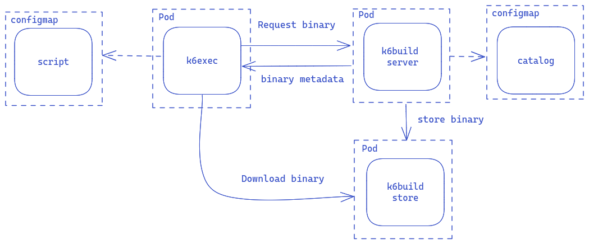

# Running k6build in Kubernetes

This example shows how to deploy k6build as a service in Kubernetes and use [k6exec](https://github.com/grafana/k6exec) for running tests using extensions.




## Requirements

This example requires access to a Kubernetes cluster and rights to deploy a service and create secrets.

For testing, you can use [minikube](https://minikube.sigs.k8s.io/docs/) or [k3d](https://k3d.io/).

### Build the image

Build the [k6build image](/Dockerfile) from this project's root directory:

```
docker build -t grafana/k6build .
```

Make the image available to your Kubernetes cluster by loading it into a repository.

This process depends on your cluster's setup. Following sections explain the process for common test cluster environments.

#### Minikube

If you are using minikube, you can use the following command:

```
minikube image load grafana/k6build
```

#### k3d

If you are using k3d, you can use the following command:

```
k3d image import grafana/k6build
```

### Create the dependencies catalog

k6build uses a [catalog](https://github.com/grafana/k6catalog) that specifies the versions supported for `k6` and the supported extensions.

The `k6build` service expects this catalog to be in the `k6build-catalog` [configmap](https://kubernetes.io/docs/tasks/configure-pod-container/configure-pod-configmap/).

The [deployment/catalog.json](deployment/catalog.json) file contains a sample catalog.

Edit it to your needs (e.g. supported k6 versions) and create a configmap:

```
kubectl create configmap k6build-catalog --from-file deployment/catalog.json
configmap/k6build-catalog created
```

### Deploy service

The [deployment/k6build.yaml](deployment/k6build.yaml) file contains the manifests for deploying as a service. It also creates a cache server to support the downloading of custom `k6` binaries.

Deploy these components with the following command:

```
kubectl apply -f deployment/k6build.yaml
pod/cachesrv created
service/cachesrv created
pod/k6build created
service/k6build created
```

### Upload the test

The test must be available as a config map.

```
kubectl create configmap k6test --from-file tests/sqlite.js
configmap/k6test created

```

### Run test using k6exec

The [deployment/k6exec.yaml](deployment/k6exec.yaml) file contains the manifest for running a job that executes the test from the `k6test` configmap.

```
kubectl create -f deployment/k6exec.yaml
pod/k6exec-2tr2j created

```

> Notice that each type a pod is created using the `deployment/k6exec.yaml` manifest, it is given a different name.

Get test results with the following command:

```
kubectl logs k6exec-2tr2j -f

          /\      |‾‾| /‾‾/   /‾‾/   
     /\  /  \     |  |/  /   /  /    
    /  \/    \    |     (   /   ‾‾\  
   /          \   |  |\  \ |  (‾)  | 
  / __________ \  |__| \__\ \_____/ .io

     execution: local
        script: test/sqlite.js
        output: -

     scenarios: (100.00%) 1 scenario, 1 max VUs, 10m30s max duration (incl. graceful stop):
              * default: 1 iterations for each of 1 VUs (maxDuration: 10m0s, gracefulStop: 30s)

time="2024-08-28T12:09:23Z" level=info msg="key: plugin-name, value: k6-plugin-sql" source=console

     █ setup

     █ teardown

     data_received........: 0 B 0 B/s
     data_sent............: 0 B 0 B/s
     iteration_duration...: avg=7.16ms min=27.68µs med=10.56ms max=10.91ms p(90)=10.84ms p(95)=10.87ms
     iterations...........: 1   44.591994/s


running (00m00.0s), 0/1 VUs, 1 complete and 0 interrupted iterations
default ✓ [ 100% ] 1 VUs  00m00.0s/10m0s  1/1 iters, 1 per VU
```

> The first time you run the test this command may take time to show any result while the binary is compiled. Subsequent executions should run almost immediately. 